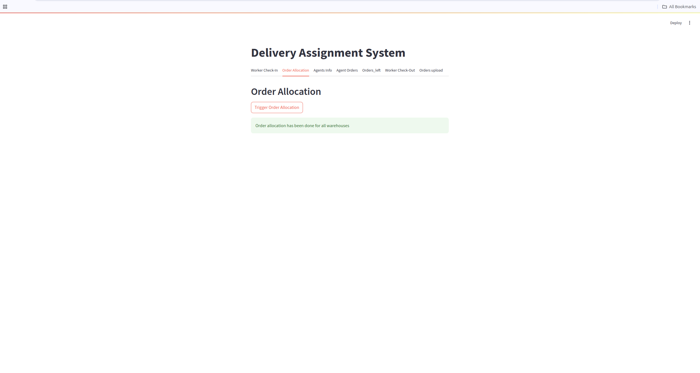
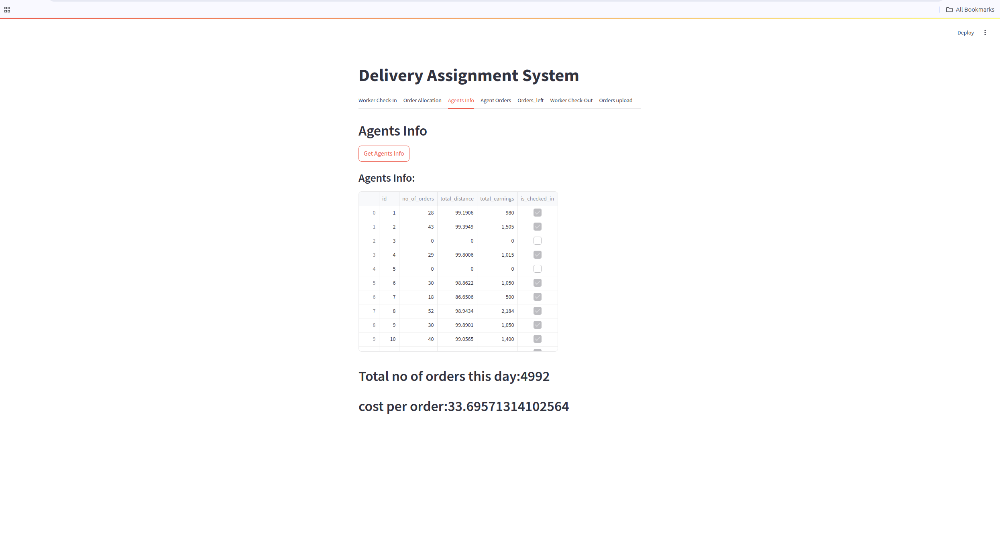
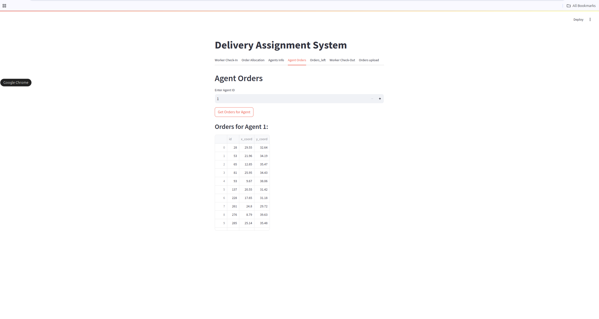
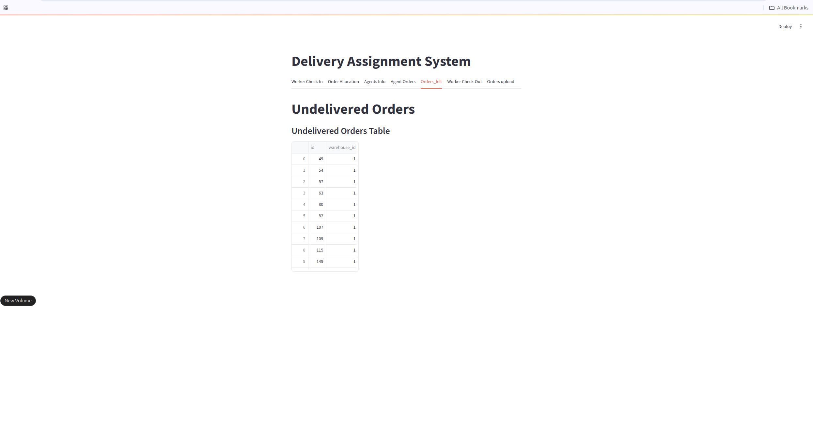
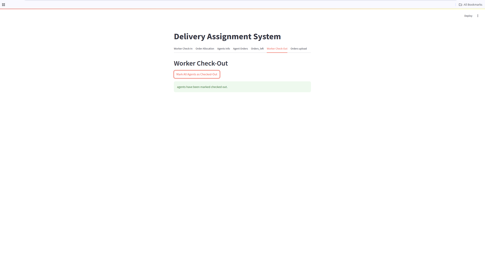
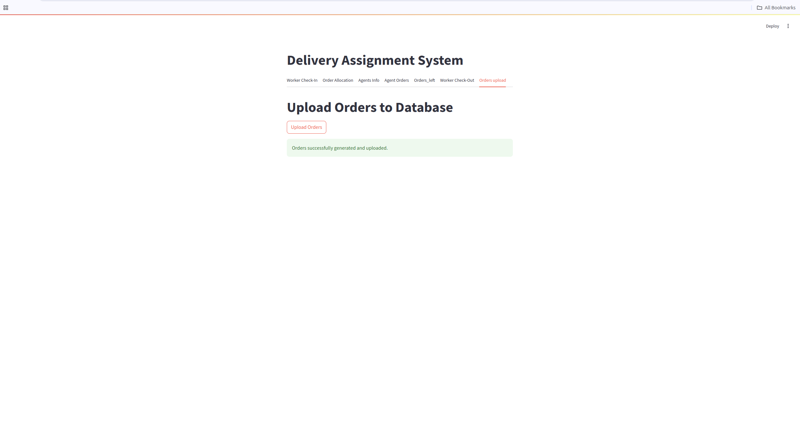

# Project Setup and Usage Guide

## Prerequisites
Ensure that you have `sqlite3` installed on your system.

## Setting Up the Environment

### For Linux

1. **Create a Python Virtual Environment**:
   ```bash
   python3 -m venv Myenv
   ```

2. **Activate the Virtual Environment**:
   ```bash
   source Myenv/bin/activate
   ```

3. **Install the Requirements**:
   ```bash
   pip install -r requirements.txt
   ```
### For Windows

1. **Create a Python Virtual Environment**:
   ```bash
   python -m venv Myenv
   ```

2. **Activate the Virtual Environment**:
   ```bash
   Myenv\Scripts\activate
   ```

3. **Install the Requirements**:
   ```bash
   pip install -r requirements.txt
   ```


## Running the Application

### 1. **Run the Server**:
   Use `gunicorn` to start the server with the following command:
   ```bash
   gunicorn -w 1 -b 127.0.0.1:8000 main:app --timeout 300
   ```

### 2. **Run the Streamlit UI**:
   Launch the Streamlit user interface by running:
   ```bash
   streamlit run app.py
   ```

## Streamlit App Overview

After setting up, your Streamlit app will have the following tabs:


### 1. **Upload Orders Tab**:
   - Click on the **"Upload Orders"** button to upload orders to the warehouse (1200 orders per warehouse).

### 2. **Worker Check-In Tab**:
   - Click on the **"Randomly Mark Agents as Checked-In"** button to randomly mark 80% of the agents as checked-in to start the day.

### 3. **Order Allocation Tab**:
   - Click on the **"Trigger Order Allocation"** button to allocate orders to agents while ensuring that the limits are not crossed.This is might take 1-2 mins to complete

### 4. **Agents Info Tab**:
   - Click on the **"Get Agents Info"** button to view a table containing agent details such as:
     - `ID`
     - `Number of Orders Allocated`
     - `Distance Covered`
     - `Earnings`
     - Total number of orders delivered
     - Cost per order ratio

### 5. **Agent Orders Tab**:
   - Click **"Get Orders for Agent"** and enter an agent ID to view the orders associated with the agent.

### 6. **Orders Left Tab**:
   - Check the orders that are still left in the warehouse.

### 7. **Worker Check-Out Tab**:
   - Click on the **"Mark All Agents as Checked-Out"** button to mark all agents as checked-out and reset their stats at the end of the day.

---
To ensure clean allocation of orders to agents, follow the order of tabs below:

1. **Worker Check-In**: Marks the start of the day.
2. **Order Allocation**: Allocates orders to agents.
3. **Agents Info**: View agent details, including orders allocated.
4. **Agent Orders**: View specific orders for each agent.
5. **Orders Left**: Check the remaining orders in the warehouse.
6. **Worker Check-Out**: Marks the end of the day and resets agent stats.


### Idea behind the implementation:

Upon reading the question, one of the most crucial aspects I considered was how to identify the delivery location of the orders. As suggested in the question, I used the method of plotting points on a 2D plane to mark the order delivery locations. 

The goal is to maximize the use of agents so that the maximum number of orders are delivered in a day. To achieve this, I started by grouping the order delivery points using **K-means**, where `k` is equal to the number of agents available, ensuring that all agents are used and are not being paid without work. After clustering with K-means, we have a set of points associated with each agent.

In order to maximize the number of orders delivered, we need to minimize the distance covered so that the distance threshold is not exceeded. To achieve this, I used the **Travelling Salesman Problem (TSP)** algorithm to find the shortest route to cover all the points. I then started assigning the orders to the agent in the order of the shortest route, until their threshold is reached.

There could be cases where the points in a cluster are fewer, meaning that the agent's threshold is not reached. For these agents, I call another function (`FUNC`) that runs iteratively. The function works as follows:

- It takes the available agents and their last order location as input.
- It forms new clusters with these points as centers.
- It uses the **Travelling Salesman** algorithm again to find the route.
- Orders are allocated to the agents accordingly.

The function (`FUNC`) is run iteratively until all agents are used.

Additionally, for cases where the number of agents available is greater than the number of orders, I have used a simple **round robin allocation** to distribute the orders.

For the **Travelling Salesman** algorithm, I used **Google OR-Tools**, as it is the quickest and has the least load on memory.

For the same reason of speed and efficiency, I used the **fastdist** library to calculate the distance matrix.


## Screenshots:
### Sign-in tab:


### Order-allocation tab:


### Agents info tab:


### Agent Orders tab:


### Orders left tab:


### Check-out tab:


### Upload orders tab:


